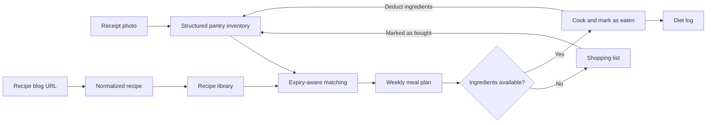

# PantryAgent

PantryAgent is an AI-assisted food management app that helps households cook what they already own before it expires. It connects pantry inventory, trusted recipes, weekly meal planning, nutrition evidence, and grocery replenishment into one continuous workflow.

Instead of treating inventory, recipes, and shopping as separate lists, PantryAgent keeps them synchronized: groceries enter the pantry, recipes are matched against available food, planned meals reveal shortages, eaten meals reduce inventory, and purchased items flow back into the pantry.

## High-Level Workflow



### 1. Build the pantry from real purchases

The user uploads a grocery receipt. Claude Vision extracts edible items, quantities, categories, and estimated shelf lives. The user can review or edit the result before saving it to Supabase as inventory sorted by expiration date.

Items can also enter the pantry from the shopping list: marking an ingredient as bought creates a new inventory record, closing the purchase-to-pantry loop.

### 2. Build a reusable recipe library

Users can save recipes and import public recipe-blog URLs. The importer first uses Browserbase Fetch to extract structured data quickly. If the page is incomplete or requires interaction, it falls back to a Browserbase browser session with Stagehand to handle popups, jump-to-recipe controls, collapsed sections, and lazy-loaded content.

Regardless of the source, recipes are normalized into the same model: title, ingredients, steps, servings, calories, tags, and source metadata. This shared shape lets imported and saved recipes participate in the same planning workflow.

### 3. Attach evidence-backed nutrition estimates

When an imported page does not provide calories, or when the user requests verification, PantryAgent selects the recipe's major ingredients and uses Browserbase Search and Fetch to collect nutrition facts from the web. Claude then reconciles those facts with ingredient quantities and serving count.

The resulting per-serving estimate is saved with its confidence level, estimation method, source links, and extracted evidence. Meal-plan cards can therefore distinguish page-reported calories from browser-supported estimates and AI fallback values.

### 4. Recommend meals around what expires first

PantryAgent supports two levels of recommendation:

- An instant local matcher ranks recipes by how many soon-to-expire ingredients they use, then by overall pantry coverage.
- The AI planner fills empty weekly meal slots using the current inventory and recipe library. It prioritizes expiring food, favors saved or imported recipes, preserves manually selected meals, encourages variety, and flags likely quantity shortages across the week.

Users can accept the generated plan or choose recipes manually for any breakfast, lunch, or dinner slot.

### 5. Close the cooking and shopping loop

Every planned recipe is compared with current inventory. Missing ingredients can be added to the shopping list for one meal or the entire week. When those items are marked as bought, they are added to the pantry.

After a meal is marked as eaten, PantryAgent deducts matching ingredient quantities from inventory, removes depleted items, records the meal and calories in the diet log, and marks the plan entry as complete. The updated pantry then drives the next recommendation cycle.

## System Overview

- **Next.js and React** provide the user interface and server-side workflow endpoints.
- **Supabase** stores inventory, recipes, meal plans, shopping items, diet logs, and web-extraction records.
- **Claude** handles receipt understanding, meal-plan generation, and nutrition reconciliation.
- **Browserbase Fetch** provides the fast path for structured web extraction and nutrition research.
- **Stagehand on Browserbase** handles recipe pages that require a real, interactive browser.

The current implementation is a single-user demo built around the `demo` user ID. AI-generated shelf-life, meal-planning, and nutrition outputs are assistive estimates and should be reviewed rather than treated as medical guidance.

## Local Development

Install dependencies and create a local environment file from `.env.example`:

```bash
npm install
cp .env.example .env.local
npm run dev
```

Configure Supabase, Anthropic, and Browserbase credentials in `.env.local`. The app expects the core Supabase tables represented by its shared data types; the included nutrition-verification migration extends recipes with evidence metadata and adds web-import logging. The seed SQL is optional demo data.
